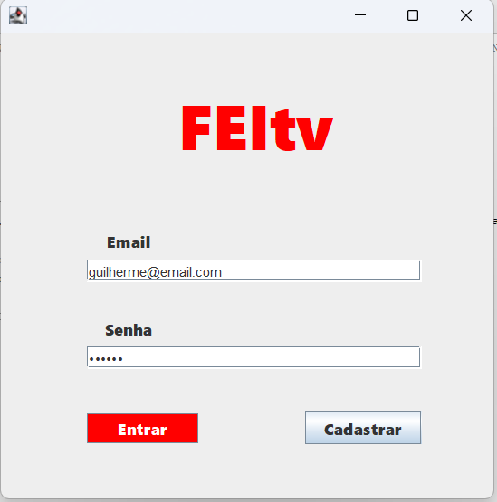
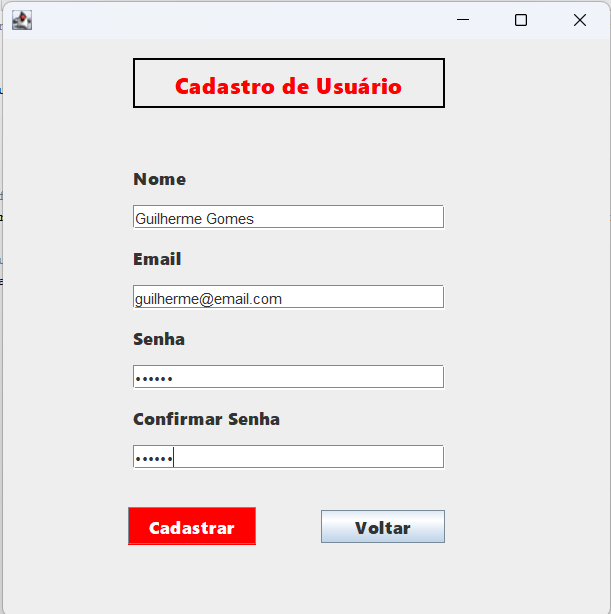
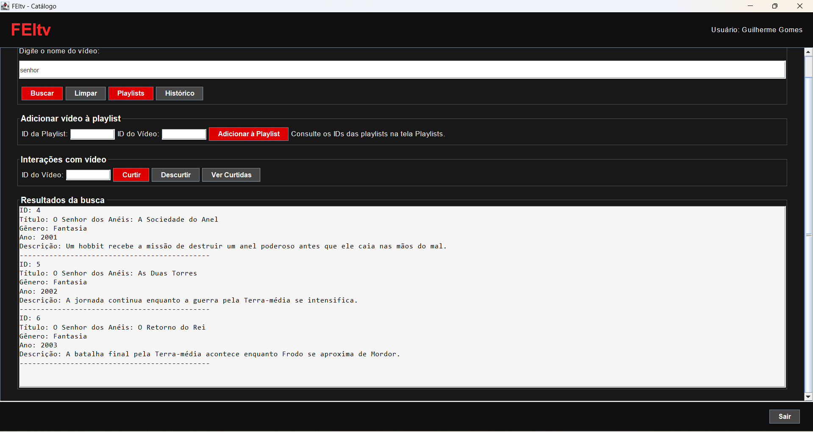
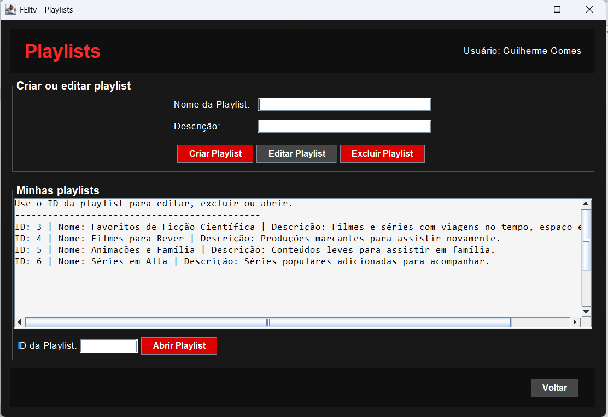
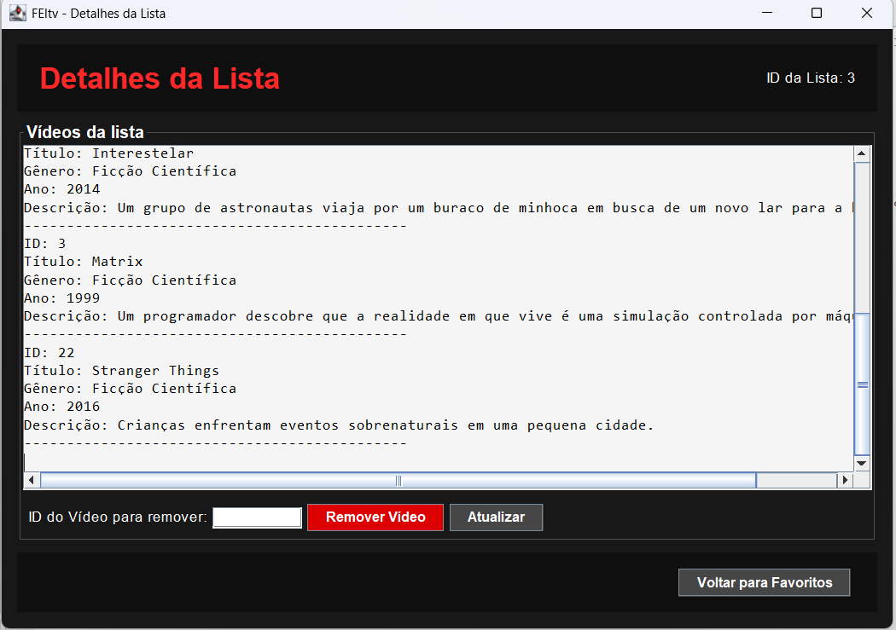
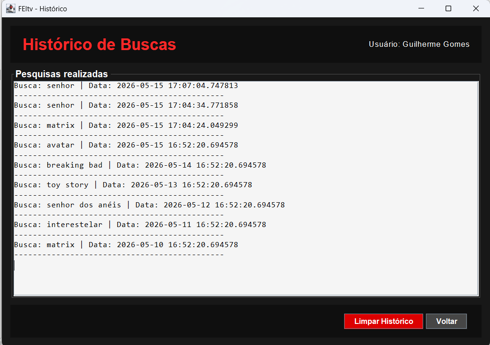
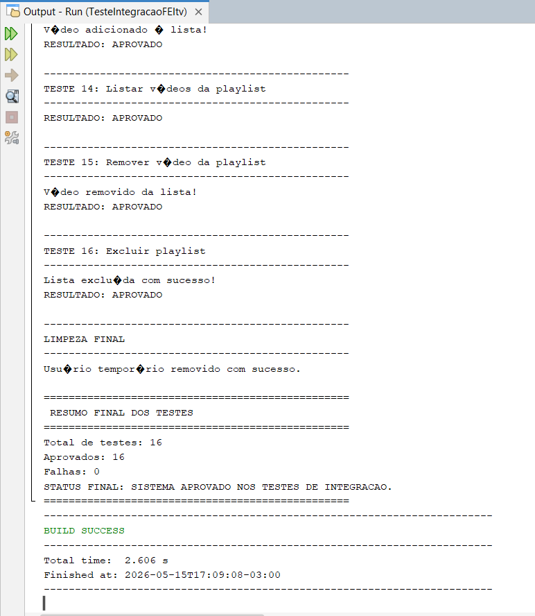
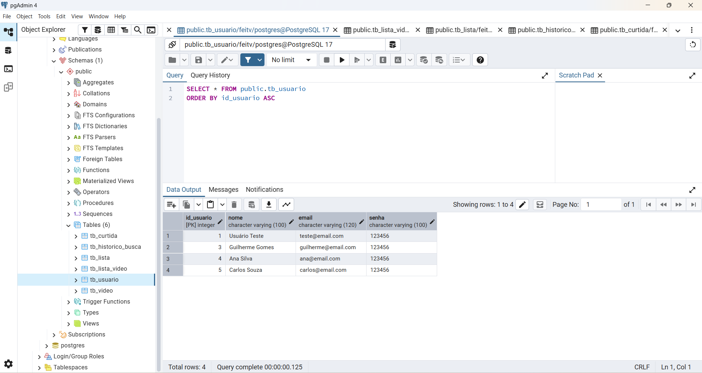

# FEItv

Sistema desktop desenvolvido em Java com Swing, PostgreSQL e arquitetura em camadas para simular uma plataforma de vídeos com autenticação de usuários, catálogo, playlists, curtidas e histórico de buscas.

O projeto foi desenvolvido com foco acadêmico, aplicando conceitos de Programação Orientada a Objetos, JDBC, banco de dados relacional, MVC, DAO e boas práticas de organização de código.

---

## Visão geral

O FEItv é uma aplicação desktop que permite ao usuário:

- cadastrar uma conta;
- realizar login;
- buscar filmes e séries no catálogo;
- curtir e descurtir vídeos;
- criar, editar e excluir playlists;
- adicionar vídeos às playlists;
- visualizar e remover vídeos de uma playlist;
- consultar histórico de buscas.

A aplicação utiliza PostgreSQL para persistência dos dados e Java Swing para a interface gráfica.

---

## Demonstração visual

### Tela de Login



### Tela de Cadastro



### Tela Principal



### Tela de Playlists



### Detalhes da Playlist



### Histórico de Buscas



### Teste de Integração



### Banco de Dados no pgAdmin



---

## Funcionalidades

### Usuário

- Cadastro de usuários
- Login com autenticação via PostgreSQL
- Controle de sessão do usuário logado

### Catálogo

- Busca de vídeos por nome
- Catálogo inicial com filmes e séries
- Exibição de título, gênero, ano e descrição

### Playlists

- Criação de playlists
- Edição de playlists
- Exclusão de playlists
- Adição de vídeos às playlists
- Remoção de vídeos das playlists
- Visualização dos vídeos de uma playlist

### Curtidas

- Curtir vídeo
- Descurtir vídeo
- Contagem de curtidas por vídeo
- Impedimento de curtidas duplicadas pelo mesmo usuário

### Histórico

- Registro automático de buscas realizadas
- Visualização do histórico do usuário logado
- Limpeza do histórico de buscas

### Testes

- Teste de integração para validar os principais fluxos do sistema sem depender da interface gráfica

---

## Tecnologias utilizadas

- Java
- Java Swing
- Maven
- PostgreSQL
- JDBC
- Apache NetBeans
- Git
- GitHub

---

## Requisitos técnicos

Para executar o projeto, recomenda-se utilizar:

| Recurso | Versão / Descrição |
|---|---|
| Java | JDK 21 |
| IDE | Apache NetBeans |
| Banco de dados | PostgreSQL |
| Gerenciador de dependências | Maven |
| Driver JDBC | PostgreSQL JDBC Driver 42.7.4 |
| Sistema operacional usado no desenvolvimento | Windows 11 |

A dependência do PostgreSQL está configurada no `pom.xml`:

```xml
<dependency>
    <groupId>org.postgresql</groupId>
    <artifactId>postgresql</artifactId>
    <version>42.7.4</version>
</dependency>
